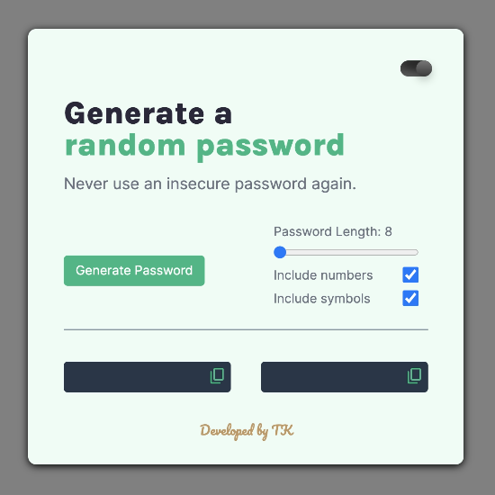
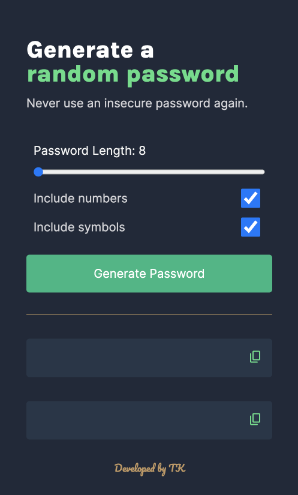

# Password Generator

A user-friendly web application to generate random passwords based on user preferences. Built as part of the Scrimba Frontend Career Path but enhanced with additional features for better usability and mobile responsiveness. Check out the [Live Demo](https://tk-password-generator.netlify.app/).

## Table of Contents

1. [Features](#features)
2. [Screenshots](#screenshots)
3. [Overview](#overview)
4. [Requirements](#requirements)
5. [Stretch Goals](#stretch-goals)
6. [Personal Stretch Goals](#personal-stretch-goals)
7. [Figma File](#figma-file)

---

## Features

- Generates two random passwords with a single click.
- Ability to customize password length.
- Toggle inclusion of symbols and numbers.
- Copy-on-click functionality.
- Mobile-first design with tooltips for better user experience.
- Light/dark mode toggle.

---

## Screenshots

---

## Overview

This is a solo project as part of the Scrimba Frontend Career Path Module 3. The primary aim of the project is to create a Random Password Generator.

---

## Requirements

- Build it from scratch 
- Generate two random passwords when the user clicks the button
- Each password should be 15 characters long

---

## Stretch Goals

- Ability to set password length 
- Add "copy-on-click" functionality
- Toggle "symbols" and "numbers" on/off 

---

## Personal Stretch Goals

- Implement a toggle switch for light/dark mode.
- UI enhancements.
- Designed a mobile-friendly version ensuring a seamless user experience on various screen sizes.
- Adopted a mobile-first design approach, prioritizing mobile users.
- Introduced tooltips for enhanced user guidance and interaction.

---

## Figma File

Design templates and inspiration for the project are based on the [Scrimba presented Figma File](https://www.figma.com/file/NEj9JDycMjF3XKXq7swoc9/Random-Password-Generator-(New-version)?node-id=0%3A1&mode=dev).

